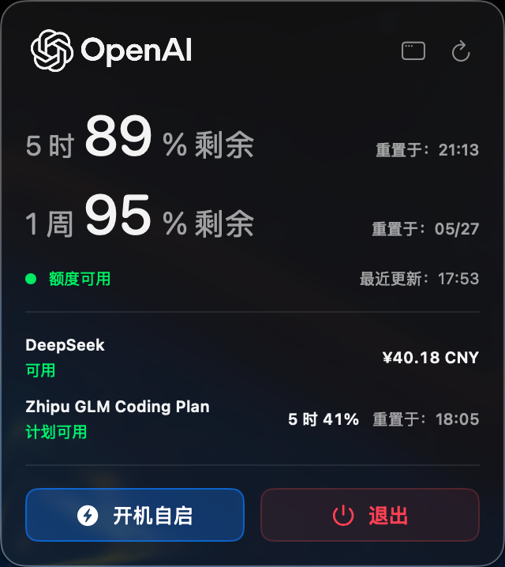
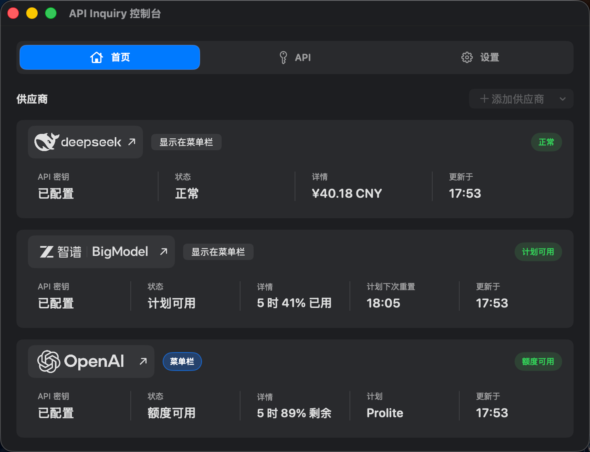

# API Inquiry v0.3.3

## Screenshots

<p>
  
</p>

<p>
  
</p>

## Polish

- The primary provider status text in the menu details panel now uses the same green success color as secondary provider status text, improving visual consistency for both Chinese and English UI.
- The Console Home marker for the provider shown in the menu bar now uses the same blue highlighted style as AutoStart.
- Added a Console Settings page and moved the language setting out of Home.
- Added version information and a Project Homepage button in Settings for opening the GitHub project page.

## Fixes

- Fixed the Console window title showing the opposite language after switching between Chinese and English.

## Verify Downloads

```bash
shasum -a 256 -c API-Inquiry-v0.3.3.dmg.sha256
```

## Known Limitations

- Apple notarization is not enabled.
